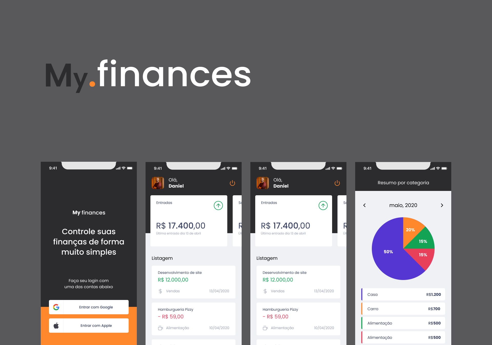

<div align="center">
  
  <p>💸 Personal finance management app 💸</p>
</div>

<div align="center">
   
</div>

<br>
<br>


# 🚀 Technologies

  - [Node.js](https://nodejs.org/en/)
  - [Expo](https://expo.io/)  
  - [React Native](https://reactnative.dev/)
  - [TypeScript](https://www.typescriptlang.org/)


## 💻 Getting started

### Requirements

- [Node.js](https://nodejs.org/en/)
- [Expo](https://expo.io/)  
- [Yarn](https://classic.yarnpkg.com/) or [NPM](https://www.npmjs.com/)

### Installing and running the project

*Clone the project and access the folder*

```bash
$ git clone https://github.com/DanielReezende/myfinances.git
$ cd myfinances
```

*Follow the steps below*

```bash
# Install the dependencies
$ yarn install

# Make a copy of '.env.example' to '.env'
# and set with YOUR environment variables.
$ cp .env.example .env

# Finally, run the api service in a development environment :)
$ yarn start

# Well done, MyFinances is started!
```
<br>

## 📝 License

This project is licensed under the MIT License - see the [LICENSE](LICENSE) file for details.

<hr>
<div align="center">
  <sub>Copyright © 2021-present, DanielReezende.</sub>
</div>
<hr>
